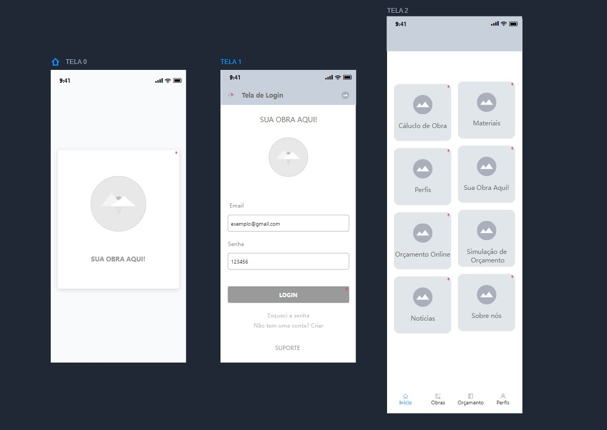
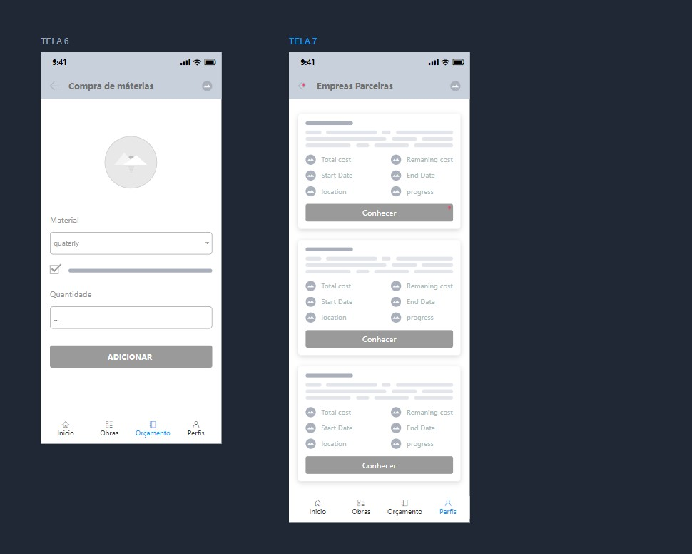
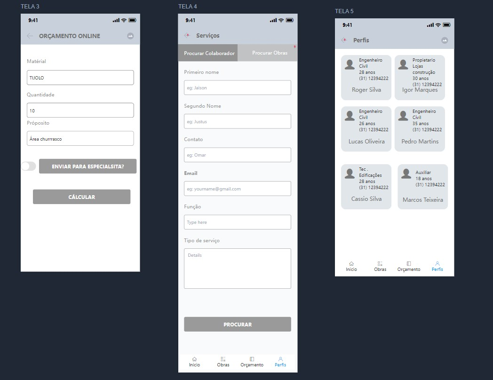
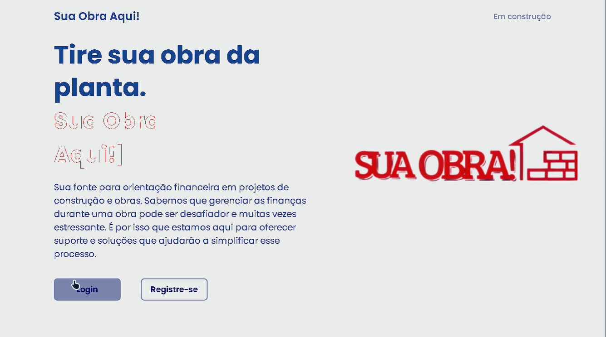

# Projeto de Interface

Pré-requisitos: <a href="2-Especificação do Projeto.md"> Documentação de Especificação</a>

## User Flow
Página Inicial:
A primeira tela que os usuários veem ao acessar a plataforma. Aqui, eles podem encontrar uma visão geral do serviço oferecido e opções para login ou registro.

Dashboard do Usuário:
Após o login, os usuários são direcionados para o dashboard, onde podem encontrar um resumo das informações relevantes para eles, como tarefas pendentes, orçamentos solicitados, notificações, etc.

Catálogo de Serviços:
Esta tela exibe uma lista dos serviços oferecidos pela plataforma, com opções de filtragem e pesquisa para facilitar a navegação e a seleção de serviços desejados.

-----------------------------------------------------------------------------------------------------------------------------------------------------------------
Detalhes do Serviço:
Ao selecionar um serviço específico, os usuários são direcionados para uma tela com detalhes mais aprofundados sobre o serviço, incluindo descrição, preço, avaliações de outros usuários, etc.

Solicitação de Orçamento:
Esta tela permite que os usuários solicitem um orçamento para um serviço específico, preenchendo um formulário com detalhes relevantes e enviando a solicitação para os prestadores de serviço.

Perfil do Usuário:
Os usuários têm acesso a um perfil personalizado onde podem gerenciar suas informações pessoais, histórico de pedidos, avaliações, preferências de comunicação, etc.

## Wireframes

Interface do site Sua Obra Aqui
